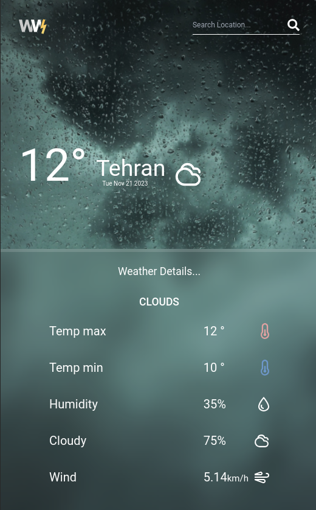

# Advanced Weather App

This app will show results about weather for any location, this info includes temprature, wind speed, min temp, max temp.

Why do i call it advanced?
i have built a simpler [weather app](https://weather-app-farnam.netlify.app/) while i was learning react, but now that i'm more experienced i wanted to build that project using best practices.
## Tech Stack

**Client:** React, Context API, TailwindCSS, Axios, TypeScript

## Screenshots

